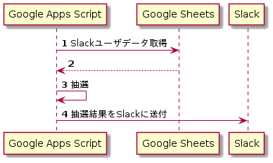
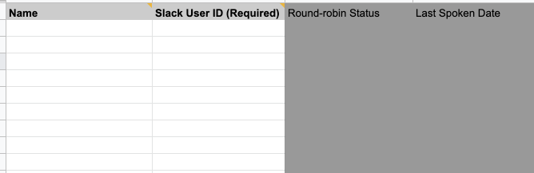

# slack_lottery_with_gas
Google Sheets (+ Apps Script) を使って Slackチャンネルのメンバーから抽選し通知する機能を実現する。
(Using Google Sheets (+ Apps Script) to draw and notify members of a Slack channel).

## 1. Background
チームビルディング（社内勉強会抽選）のために作ったものである。
通知の文言を変更すればいろんなシーンに使えそうで公開することにした。
（車輪の製造はやめようぜw） 

## 2. 仕組み

## 3. Setup

* Step1. Google Driveに以下のようなGoogle Sheetsファイルを作成し、抽選対象となるSlackチャンネルにあるユーザ情報を埋め込む。
  
* Step2. Step1で作成されたファイルのメニューから 「Tools」→ 「Script Editor」から Apps Scriptを開き、Scriptファイルを作成し、src/Code.gsの中身をコピペ。
* Step3. SPREAD_SHEETS_IDとSLACK_WEB_HOOK_URLを入れ替える。
* Step4. 「Triggers」画面に移動し、RobinStudySession関数を実行するトリガーを追加。
